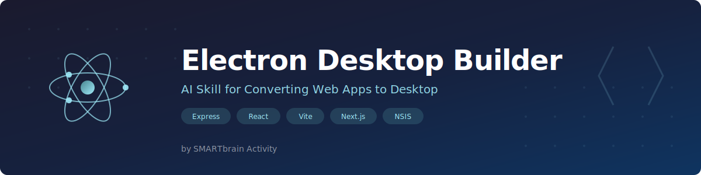

# Electron Desktop Builder — AI Skill para Antigravity · Claude Code · Gemini CLI · Cursor



[](https://www.smartbrainactivity.ai)
[](/LICENSE)
[]()
[]()
[]()
[]()

Skill experto de IA para asistentes de coding (como Claude, Antigravity, Cursor, etc.) disenado para convertir aplicaciones web existentes en apps de escritorio Electron desde el chat o terminal.

[Read in English](README.md)

## Que hace este skill

Dada una aplicacion web existente (Express, React, Vite, Next.js o estatica), este skill genera todos los archivos y configuracion necesarios para producir una app Electron funcional con installer NSIS para Windows.

Gestiona:
1. **Deteccion de proyecto** — Identifica framework, backend, herramienta de build
2. **Proceso principal** — Crea `electron/main.ts` con splash, tray, single instance lock
3. **Preload bridge** — Crea `electron/preload.ts` con IPC aislado por contexto
4. **Generacion de iconos** — Convierte logos SVG/PNG a archivos .ico multi-tamanio
5. **Configuracion del installer** — NSIS con ruta de instalacion personalizada, accesos directos
6. **Pipeline de build** — Modifica package.json, vite config, scripts de build
7. **Server embebido** — Encapsula servidores Express/Fastify dentro del proceso main de Electron

## Skill complementario

Este skill se complementa con [**electron-desktop-builds**](https://github.com/smartbrainactivity/electron-desktop-builds) para troubleshooting:

| Skill | Cuando usarlo |
|-------|--------------|
| **electron-desktop-builder** (este) | Empezar desde cero, primer setup Electron |
| **electron-desktop-builds** | Build falla, pantalla negra, iconos incorrectos, errores de empaquetado |

**Flujo de trabajo:**
```
App web → electron-desktop-builder → Primer build
                                          ↓
                                    Funciona? → Listo
                                    Falla? → electron-desktop-builds → Reparar → Rebuild
```

## Instalacion

```bash
# Clonar en tu directorio de skills
git clone https://github.com/smartbrainactivity/electron-desktop-builder.git

# Para Claude Code:
# Colocar en ~/.claude/skills/ o en el directorio de skills del proyecto

# Para otros asistentes IA:
# Colocar en el directorio de skills/knowledge de tu asistente
```

## Uso

Indica a tu asistente IA:

> "Convierte esta app web en una app de escritorio con Electron"

> "Configura Electron para este proyecto Express + React"

> "Crea el build de Electron para Windows con installer NSIS"

El skill guiara al asistente a traves del proceso de 10 pasos definido en `SKILL.md`.

## Tipos de proyecto soportados

| Framework | Backend | Enfoque |
|-----------|---------|---------|
| Express + React/Vite | Si | Embeber Express en localhost |
| Vite / CRA (estatico) | No | Cargar desde file:// |
| Next.js (export estatico) | No | Cargar desde file:// |
| Next.js (servidor) | Si | Embeber servidor en localhost |
| Cualquier servidor Node.js | Si | Embeber en localhost |

## Privacidad

- No se recopilan ni transmiten datos
- Todo el procesamiento es local
- No requiere API keys ni credenciales

---

**Creado por** [SMARTbrain Activity](https://www.smartbrainactivity.ai) | [hey@smartbrainactivity.ai](mailto:hey@smartbrainactivity.ai)

## Licencia

[MIT](LICENSE)
